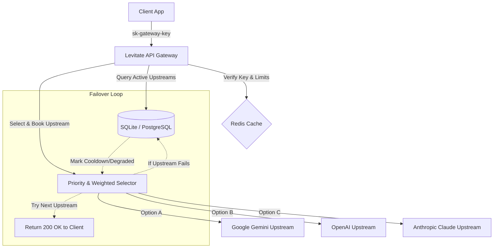

# 🚀 Levitate API — Premium LLM Routing Proxy & Dashboard

[](https://fastapi.tiangolo.com)
[](https://nextjs.org)
[](https://redis.io)
[](https://www.docker.com)
[](LICENSE)

**Levitate API** is a high-performance, OpenAI-compatible **SaaS LLM routing proxy** and analytics platform. It serves as an intelligent gateway sitting between your applications and upstream LLM providers (e.g., Google Gemini, OpenAI, Anthropic), offering dynamic load balancing, automatic failover, virtual key management, and real-time usage auditing.

---

## ✨ Key Features

*   🔄 **OpenAI-Compatible API**: Seamless drop-in replacement supporting `/v1/chat/completions` and `/v1/embeddings` requests.
*   🔀 **Smart Load Balancing & Routing**: Group upstream credentials by priority tiers and assign load-balancing weights. Supports concurrency limitations managed via Redis.
*   🛡️ **Instant Database-Backed Failover**: If an upstream API returns a rate limit (429), quota exhaustion, or connection error, the gateway immediately updates its status in the DB and retries the request using backup upstreams seamlessly.
*   🔑 **Virtual Keys & Limits**: Issue client-facing keys (`sk-gateway-...`) with granular RPM (requests per minute) limits, allowed model groups, and monthly token caps.
*   🔌 **Google OAuth Integration**: Connect multiple Google Accounts with a single click to leverage free/paid Gemini quotas across the gateway.
*   📊 **Stunning Admin Dashboard**: A premium, responsive glassmorphic console built with Next.js App Router featuring light/dark modes (iOS 16 Liquid Glass system) and full English/Russian localization.
*   🔒 **Enterprise Egress Security**: Built-in SSRF protection, outbound payload sanitization, and automated secret leak scanning.

---

## 📐 Architecture Overview



---

## 📂 Project Structure

```
├── backend/                  # FastAPI Backend API Server & Async Workers
│   ├── app/
│   │   ├── api/              # Routers (V1, Admin, Auth) & Pydantic schemas
│   │   ├── routing/          # Weighted priority selection algorithms
│   │   ├── providers/        # LiteLLM & Antigravity (Google OAuth Gemini) integrations
│   │   ├── workers/          # Background workers (health check, quota resets, token refreshes)
│   │   └── main.py           # FastAPI entrypoint
│   └── dev.db                # SQLite Local Development Database
├── frontend/                 # Next.js Frontend Admin Panel (App Router)
│   ├── src/
│   │   ├── app/              # Authentication middleware & layout route views
│   │   ├── components/       # Premium glassmorphic component layouts (Overview, Credentials, Keys, Logs)
│   │   └── store/            # Zustand state engine & RU/EN translations
└── docker-compose.yml        # Multi-container orchestrator (Redis, DB, Backend, Frontend)
```

---

## 🚀 Quick Start (Docker Compose)

The easiest way to spin up the entire platform (Gateway, Redis, Database, and Admin Panel) is using Docker Compose:

```bash
docker-compose up --build
```

### Services Access Port Mappings:
*   **Next.js Dashboard**: [http://localhost:3000](http://localhost:3000)
*   **FastAPI Backend Gateway**: [http://localhost:8000](http://localhost:8000)
*   **Backend Health Check**: [http://localhost:8000/health](http://localhost:8000/health)

---

## 🛠️ Local Development Setup

### 1. Prerequisite Infrastructure
Launch local instances of PostgreSQL and Redis:

```bash
docker run -d --name pg-local -p 5432:5432 -e POSTGRES_USER=postgres -e POSTGRES_PASSWORD=password -e POSTGRES_DB=gateway postgres:15-alpine
docker run -d --name redis-local -p 6379:6379 redis:7-alpine
```

### 2. Backend Gateway Setup
Navigate to the `backend` directory, create a virtual environment, install dependencies, and run:

```bash
cd backend
python3 -m venv venv
source venv/bin/activate
pip install -r requirements.txt
cp ../.env.example .env
uvicorn app.main:app --host 0.0.0.0 --port 8000 --reload
```

### 3. Frontend Dashboard Setup
Navigate to the `frontend` directory, install package dependencies, and start the development server:

```bash
cd ../frontend
npm install
npm run dev
```

Open [http://localhost:3000](http://localhost:3000) in your browser to view the admin console.

---

## 📚 Docs

*   [Cloudflare Worker proxy (Cloud Code geo bypass)](docs/cloudflare-worker-proxy.md)
*   [SSH tunnel for Google account OAuth](docs/ssh-tunnel-guide.md)

---

## 📜 License

Distributed under the MIT License. See `LICENSE` for more information.
